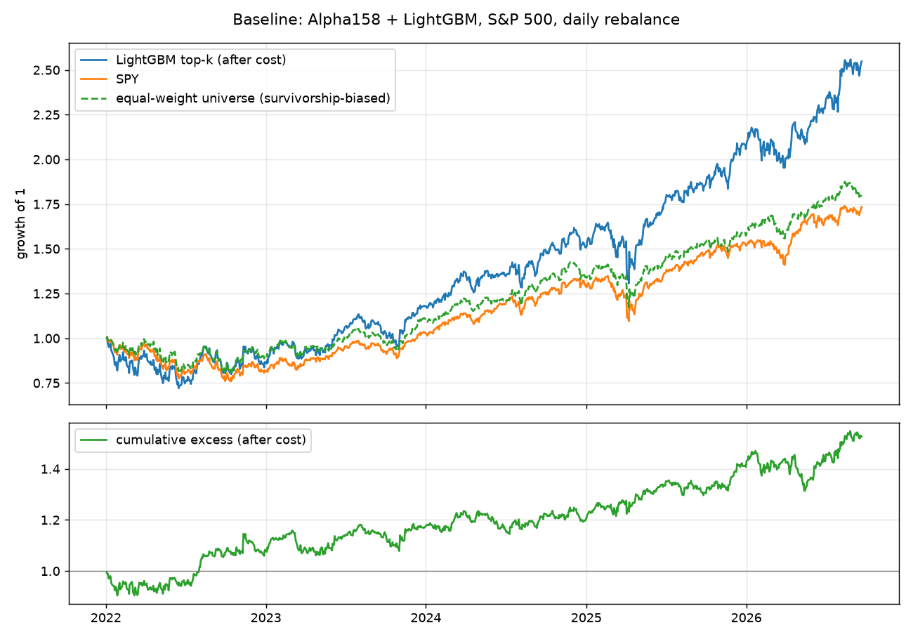

# 基线报告：Alpha158 + LightGBM（股票池 `sp500`，日频）

生成时间：2026-09-21 16:41  ·  代码版本：e63c6e7

## 数据

- 股票池：`sp500`，500 只。当前标普 500 成分股（Wikipedia 名单），含 2022 年后才入选的 78 只，存在幸存者偏差，见下文
- 基准：SPY；数据：Yahoo 日线，2010-01-04 → 2026-09-21，4204 个交易日
- 特征：Qlib Alpha158 去掉 VWAP0（Yahoo 无成交均价字段），共 157 个，RobustZScore 归一化 + 缺失填零；标签：`Ref($close, -6) / Ref($close, -1) - 1`（5 日前向收益，t+1 收盘进、t+6 收盘出，无未来函数），训练时对标签做横截面排序归一化
- 切分：训练 2010-01-01 → 2019-12-31；验证 2020-01-01 → 2021-12-31；测试 2022-01-01 → 2026-09-21（单次切分，非滚动）

## 模型

- LightGBM，Qlib 公开基准参数：learning_rate 0.2，num_leaves 210，max_depth 8，lambda_l1 205.6999，lambda_l2 580.9768，colsample 0.8879，subsample 0.8789
- 早停：验证集 50 轮无提升即停；实际最佳轮数 11

## 预测力（测试期，样本外）

| 指标 | 值 |
|---|---|
| 交易日数 | 1177 |
| IC 均值 | 0.0123 |
| ICIR | 0.103 |
| RankIC 均值 | 0.0069 |
| RankIC 标准差 | 0.1182 |
| RankICIR | 0.058 |
| RankIC>0 的天数占比 | 50.98% |
| RankIC t 统计量（按日独立假设，偏乐观） | 2.00 |

按年：

| 年 | IC | RankIC | RankICIR | 天数 |
|---|---|---|---|---|
| 2022 | 0.0082 | 0.0135 | 0.090 | 251 |
| 2023 | 0.0201 | 0.0110 | 0.103 | 250 |
| 2024 | 0.0123 | 0.0082 | 0.087 | 252 |
| 2025 | 0.0142 | 0.0016 | 0.014 | 250 |
| 2026 | 0.0046 | -0.0028 | -0.023 | 174 |

## 回测（多头 top-k，等权，日频调仓，扣费）

- 策略：每日按预测分数持有前 50 只，每日最多换出 5 只（Qlib TopkDropout）；初始资金 100,000；成本买卖各 5 bp，最低 1 美元；收盘价成交

「等权股票池」= 同一批 500 只股票每日等权持有，不用任何模型。它和 SPY 的差距就是股票池选择（幸存者偏差）加等权效应的贡献；**策略只有超过它的部分才可能是模型的功劳。**

| 指标 | 策略（扣费） | SPY | 等权股票池 | 超额 vs SPY | 超额 vs 等权股票池 |
|---|---|---|---|---|---|
| 年化收益 | 23.05% | 13.25% | 13.97% | 9.81% | 9.08% |
| 年化波动 | 25.06% | 17.37% | 16.94% | 12.65% | 11.93% |
| 夏普 / 信息比率 | 0.92 | 0.76 | 0.82 | 0.78 | 0.76 |
| 最大回撤 | -27.95% | -24.50% | -20.15% | -10.63% | -12.41% |
| 区间总收益 | 154.80% | 73.51% | 80.11% | 52.65% | 48.16% |
| 成本拖累（年化） | 2.66% | | | | |

按年：

| 年 | 策略 | SPY | 等权股票池 | 超额 vs SPY | 超额 vs 等权 | 日均换手 | 天数 |
|---|---|---|---|---|---|---|---|
| 2022 | -13.17% | -18.18% | -9.90% | 9.25% | -0.32% | 20.44% | 251 |
| 2023 | 35.78% | 26.18% | 23.13% | 8.49% | 10.77% | 20.26% | 250 |
| 2024 | 27.83% | 24.89% | 20.88% | 3.08% | 6.42% | 20.19% | 252 |
| 2025 | 36.53% | 17.72% | 17.38% | 16.43% | 16.96% | 20.19% | 250 |
| 2026 | 23.84% | 14.32% | 14.43% | 8.78% | 8.82% | 20.43% | 180 |

## 最重要的 20 个特征（LightGBM gain）

| 特征 | gain 占比 |
|---|---|
| STD60 | 10.70% |
| ROC60 | 7.41% |
| WVMA30 | 7.23% |
| IMIN60 | 6.01% |
| WVMA60 | 5.81% |
| CORD60 | 5.57% |
| IMXD60 | 5.36% |
| CORR60 | 5.00% |
| RSQR60 | 4.96% |
| VSTD60 | 4.66% |
| IMXD10 | 4.40% |
| IMAX60 | 4.13% |
| BETA60 | 3.99% |
| RESI20 | 3.92% |
| BETA20 | 3.77% |
| STD30 | 3.74% |
| MIN20 | 3.56% |
| MAX5 | 3.31% |
| CORD30 | 3.26% |
| RSQR20 | 3.22% |

## 必须知道的局限

1. **幸存者偏差**：股票池是 2026 年的标普 500 名单，回测期内被剔除、破产、被收购的公司不在里面。这会抬高多头组合收益，也可能抬高 IC。上表「等权股票池」一列就是这个偏差的量级；修复需要历史成分股名单（下一阶段）。
2. **单次切分**：一次训练、一段测试。生产上要滚动重训（每年或每季），结果通常会打折。
3. **成本假设简化**：每边 5 bp 是大盘股的粗估，未建模冲击成本和隔夜跳空；日频调仓的换手率决定了成本敏感度，见按年表的换手列。
4. **标签与调仓错配**：标签是 5 日收益，回测是日频 TopkDropout 调仓，持仓期由 n_drop 隐式决定，不是严格的 5 日持有。
5. **公开因子、公开模型**：Alpha158 + LightGBM 是所有人都能跑的组合，任何超额都应默认是拥挤的。

## 下一步（按 docs/02 方案）

- 记录本报告的 RankIC / 超额作为基线数字；后续每加一层（Kronos 特征、Laya 事件特征）都只看相对这里的增量。
- 滚动训练版本；历史成分股名单；再决定是否上 IBKR 模拟盘。