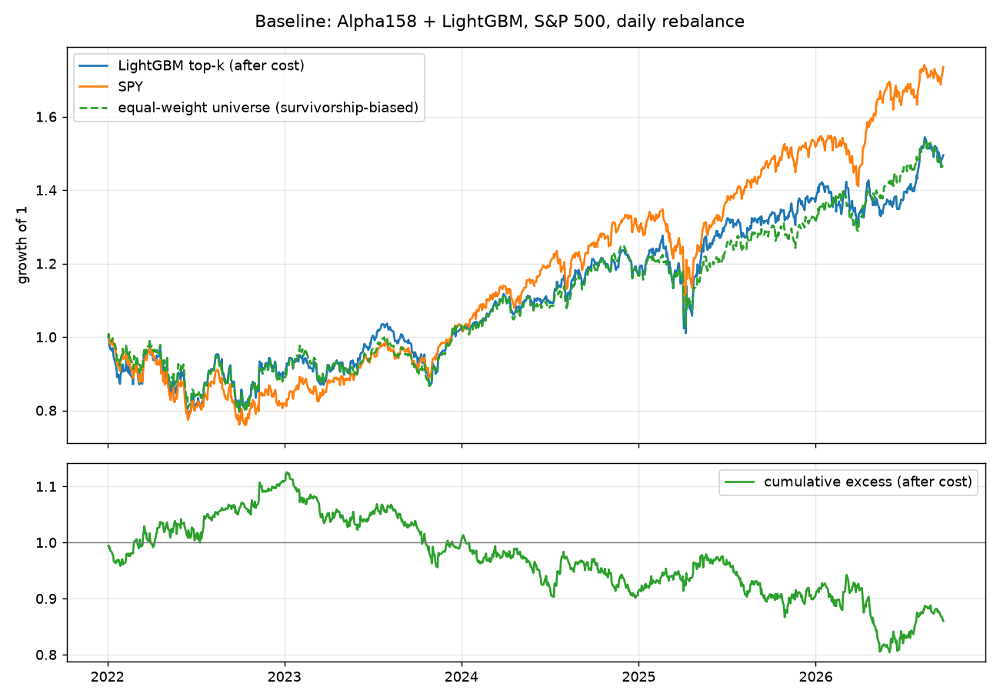

# 基线报告：Alpha158 + LightGBM（股票池 `sp500_pit`，日频）

生成时间：2026-09-22 09:16  ·  代码版本：07f8903

## 数据

- 股票池：`sp500_pit`，613 只。逐日历史成分股（Wikipedia 变更表重建，Qlib 分段有效期），每只股票只在其成员期内参与训练、预测与选股；被收购退市者因 Yahoo 无数据缺失，见 docs/04；标签期限检查：20 日前向收益
- 基准：SPY；数据：Yahoo 日线，2010-01-04 → 2026-09-21，4204 个交易日
- 特征：Qlib Alpha158 去掉 VWAP0（Yahoo 无成交均价字段），共 157 个，RobustZScore 归一化 + 缺失填零；标签：`Ref($close, -21) / Ref($close, -1) - 1`（20 日前向收益，t+1 收盘进、t+21 收盘出，无未来函数），训练时对标签做横截面排序归一化
- 切分：训练 2010-01-01 → 2019-12-31；验证 2020-01-01 → 2021-12-31；测试 2022-01-01 → 2026-09-21（单次切分，非滚动）

## 模型

- LightGBM，Qlib 公开基准参数：learning_rate 0.2，num_leaves 210，max_depth 8，lambda_l1 205.6999，lambda_l2 580.9768，colsample 0.8879，subsample 0.8789
- 早停：验证集 50 轮无提升即停；实际最佳轮数 2

## 预测力（测试期，样本外）

| 指标 | 值 |
|---|---|
| 交易日数 | 1162 |
| IC 均值 | 0.0020 |
| ICIR | 0.023 |
| RankIC 均值 | -0.0008 |
| RankIC 标准差 | 0.0825 |
| RankICIR | -0.010 |
| RankIC>0 的天数占比 | 50.52% |
| RankIC t 统计量（按日独立假设，偏乐观） | -0.34 |

按年：

| 年 | IC | RankIC | RankICIR | 天数 |
|---|---|---|---|---|
| 2022 | -0.0034 | -0.0076 | -0.081 | 251 |
| 2023 | 0.0086 | 0.0078 | 0.096 | 250 |
| 2024 | 0.0075 | 0.0063 | 0.081 | 252 |
| 2025 | 0.0035 | -0.0091 | -0.105 | 250 |
| 2026 | -0.0112 | -0.0020 | -0.033 | 159 |

## 回测（多头 top-k，等权，日频调仓，扣费）

- 策略：每日按预测分数持有前 50 只，每日最多换出 5 只（Qlib TopkDropout）；初始资金 100,000；成本买卖各 5 bp，最低 1 美元；收盘价成交

「等权股票池」= 同一批 500 只股票每日等权持有，不用任何模型。它和 SPY 的差距就是股票池选择（幸存者偏差）加等权效应的贡献；**策略只有超过它的部分才可能是模型的功劳。**

| 指标 | 策略（扣费） | SPY | 等权股票池 | 超额 vs SPY | 超额 vs 等权股票池 |
|---|---|---|---|---|---|
| 年化收益 | 10.52% | 13.25% | 9.59% | -2.73% | 0.93% |
| 年化波动 | 19.81% | 17.37% | 16.52% | 9.85% | 7.27% |
| 夏普 / 信息比率 | 0.53 | 0.76 | 0.58 | -0.28 | 0.13 |
| 最大回撤 | -22.26% | -24.50% | -21.09% | -28.56% | -11.20% |
| 区间总收益 | 49.51% | 73.51% | 47.11% | -14.00% | 3.18% |
| 成本拖累（年化） | 2.65% | | | | |

按年：

| 年 | 策略 | SPY | 等权股票池 | 超额 vs SPY | 超额 vs 等权 | 日均换手 | 天数 |
|---|---|---|---|---|---|---|---|
| 2022 | -9.92% | -18.18% | -10.95% | 10.68% | 2.44% | 20.35% | 251 |
| 2023 | 13.11% | 26.18% | 15.84% | -10.61% | -2.22% | 20.16% | 250 |
| 2024 | 15.41% | 24.89% | 13.39% | -8.00% | 1.78% | 20.05% | 252 |
| 2025 | 16.31% | 17.72% | 12.11% | -0.49% | 4.74% | 20.10% | 250 |
| 2026 | 9.31% | 14.32% | 12.18% | -4.40% | -2.36% | 20.31% | 180 |

## 最重要的 20 个特征（LightGBM gain）

| 特征 | gain 占比 |
|---|---|
| IMXD60 | 11.89% |
| CORR60 | 9.08% |
| BETA60 | 8.82% |
| WVMA60 | 8.47% |
| WVMA30 | 7.03% |
| MA30 | 6.20% |
| STD60 | 5.86% |
| ROC60 | 5.86% |
| QTLU30 | 4.45% |
| CNTP60 | 4.38% |
| IMIN30 | 3.92% |
| WVMA20 | 3.52% |
| IMIN60 | 3.47% |
| STD30 | 3.31% |
| STD20 | 2.95% |
| CORD60 | 2.77% |
| IMXD30 | 2.29% |
| IMAX60 | 2.05% |
| SUMN60 | 1.96% |
| SUMN20 | 1.71% |

## 必须知道的局限

1. **幸存者偏差**：股票池是 2026 年的标普 500 名单，回测期内被剔除、破产、被收购的公司不在里面。这会抬高多头组合收益，也可能抬高 IC。上表「等权股票池」一列就是这个偏差的量级；修复需要历史成分股名单（下一阶段）。
2. **单次切分**：一次训练、一段测试。生产上要滚动重训（每年或每季），结果通常会打折。
3. **成本假设简化**：每边 5 bp 是大盘股的粗估，未建模冲击成本和隔夜跳空；日频调仓的换手率决定了成本敏感度，见按年表的换手列。
4. **标签与调仓错配**：标签是 5 日收益，回测是日频 TopkDropout 调仓，持仓期由 n_drop 隐式决定，不是严格的 5 日持有。
5. **公开因子、公开模型**：Alpha158 + LightGBM 是所有人都能跑的组合，任何超额都应默认是拥挤的。

## 下一步（按 docs/02 方案）

- 记录本报告的 RankIC / 超额作为基线数字；后续每加一层（Kronos 特征、Laya 事件特征）都只看相对这里的增量。
- 滚动训练版本；历史成分股名单；再决定是否上 IBKR 模拟盘。