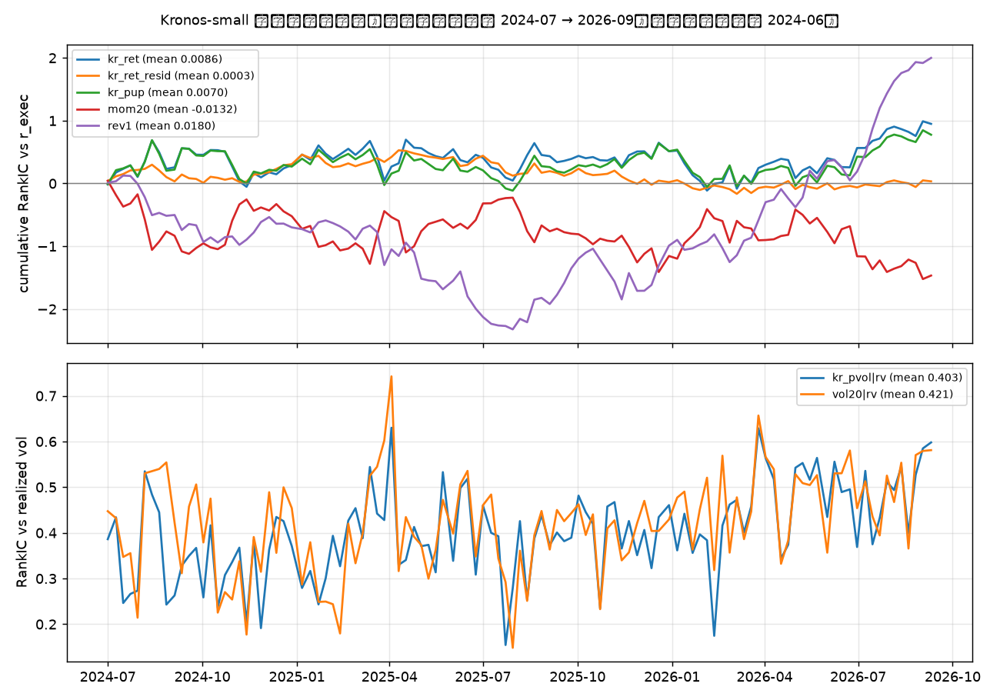

# Kronos-small 零样本信号评估：干净样本外窗口 2024-07 → 2026-09（预训练数据截止 2024-06）

样本：54,809 个（股票, 日期）对，111 个调度日，2024-07-01 → 2026-09-10；目标 r_exec = t+1 收盘进、t+6 收盘出（与 Qlib 标签一致），r_now = t → t+5。

| 信号 | 目标 | RankIC | t 值 | 正天数占比 | n |
|---|---|---|---|---|---|
| kr_ret | r_exec | 0.0086 | 0.60 | 49% | 111 |
| kr_ret | r_now | 0.0103 | 0.74 | 49% | 111 |
| kr_med | r_exec | 0.0078 | 0.56 | 49% | 111 |
| kr_med | r_now | 0.0098 | 0.72 | 50% | 111 |
| kr_pup | r_exec | 0.0070 | 0.52 | 48% | 111 |
| kr_pup | r_now | 0.0070 | 0.53 | 49% | 111 |
| kr_vol | r_exec | 0.0193 | 1.25 | 50% | 111 |
| kr_vol | r_now | 0.0226 | 1.48 | 54% | 111 |
| kr_ret1 | r_exec | 0.0064 | 0.66 | 53% | 111 |
| kr_ret1 | r_now | 0.0079 | 0.79 | 54% | 111 |
| kr_pvol | r_exec | 0.0285 | 1.51 | 52% | 111 |
| kr_pvol | r_now | 0.0318 | 1.67 | 53% | 111 |
| mom5 | r_exec | -0.0239 | -1.54 | 44% | 111 |
| mom5 | r_now | -0.0121 | -0.80 | 46% | 111 |
| mom20 | r_exec | -0.0132 | -0.75 | 51% | 111 |
| mom20 | r_now | -0.0119 | -0.66 | 52% | 111 |
| mom60 | r_exec | -0.0019 | -0.10 | 47% | 111 |
| mom60 | r_now | -0.0019 | -0.10 | 51% | 111 |
| vol20 | r_exec | 0.0198 | 0.92 | 53% | 111 |
| vol20 | r_now | 0.0238 | 1.16 | 53% | 111 |
| rev1 | r_exec | 0.0180 | 1.05 | 56% | 111 |
| rev1 | r_now | 0.0115 | 0.73 | 52% | 111 |
| kr_ret1 | r1 | 0.0032 | 0.29 | 52% | 111 |
| kr_ret | r1 | 0.0084 | 0.54 | 53% | 111 |
| rev1 | r1 | 0.0078 | 0.43 | 49% | 111 |
| mom5 | r1 | 0.0007 | 0.04 | 53% | 111 |
| kr_vol | rv | 0.3156 | 41.59 | 100% | 111 |
| kr_pvol | rv | 0.4028 | 42.32 | 100% | 111 |
| vol20 | rv | 0.4213 | 41.09 | 100% | 111 |
| kr_ret_resid | r_exec | 0.0003 | 0.05 | 51% | 111 |
| kr_ret_resid | r_now | -0.0003 | -0.05 | 50% | 111 |

kr_ret 五分位多空（Q5−Q1）每期均值 0.014%，t 0.07，粗略年化 0.7%（不含成本）。

kr_ret 对 r_exec 的 RankIC 按年：2024: 0.0113, 2025: 0.0044, 2026: 0.0125

kr_ret 与对照信号的横截面 Spearman 相关（按日均值）：mom5: -0.422, mom20: -0.607, mom60: -0.474, rev1: 0.248, vol20: 0.068。`kr_ret_resid` 是把 kr_ret 的秩对这些对照的秩逐日回归后的残差。
