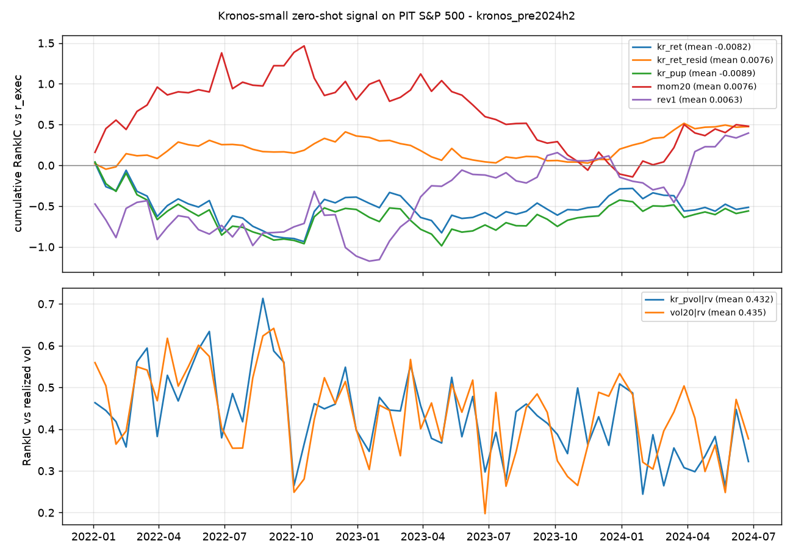

# Kronos-small 信号评估：预训练数据覆盖期 2022-01 → 2024-06（泄漏诊断，不是测试）

样本：30,208 个（股票, 日期）对，63 个调度日，2022-01-03 → 2024-06-24；目标 r_exec = t+1 收盘进、t+6 收盘出（与 Qlib 标签一致），r_now = t → t+5。

| 信号 | 目标 | RankIC | t 值 | 正天数占比 | n |
|---|---|---|---|---|---|
| kr_ret | r_exec | -0.0082 | -0.52 | 44% | 63 |
| kr_ret | r_now | -0.0090 | -0.58 | 46% | 63 |
| kr_med | r_exec | -0.0081 | -0.54 | 43% | 63 |
| kr_med | r_now | -0.0081 | -0.55 | 48% | 63 |
| kr_pup | r_exec | -0.0089 | -0.62 | 44% | 63 |
| kr_pup | r_now | -0.0149 | -1.01 | 43% | 63 |
| kr_vol | r_exec | -0.0084 | -0.42 | 48% | 63 |
| kr_vol | r_now | 0.0019 | 0.08 | 52% | 63 |
| kr_ret1 | r_exec | -0.0148 | -1.18 | 44% | 63 |
| kr_ret1 | r_now | -0.0130 | -1.06 | 43% | 63 |
| kr_pvol | r_exec | -0.0138 | -0.51 | 46% | 63 |
| kr_pvol | r_now | 0.0052 | 0.17 | 57% | 63 |
| mom5 | r_exec | 0.0201 | 1.09 | 57% | 63 |
| mom5 | r_now | 0.0131 | 0.67 | 57% | 63 |
| mom20 | r_exec | 0.0076 | 0.37 | 49% | 63 |
| mom20 | r_now | 0.0243 | 1.17 | 60% | 63 |
| mom60 | r_exec | -0.0143 | -0.69 | 44% | 63 |
| mom60 | r_now | 0.0085 | 0.40 | 51% | 63 |
| vol20 | r_exec | -0.0199 | -0.75 | 44% | 63 |
| vol20 | r_now | -0.0036 | -0.12 | 56% | 63 |
| rev1 | r_exec | 0.0063 | 0.28 | 56% | 63 |
| rev1 | r_now | 0.0053 | 0.22 | 60% | 63 |
| kr_ret1 | r1 | -0.0113 | -0.78 | 56% | 63 |
| kr_ret | r1 | 0.0020 | 0.10 | 46% | 63 |
| rev1 | r1 | -0.0110 | -0.45 | 54% | 63 |
| mom5 | r1 | 0.0261 | 1.10 | 59% | 63 |
| kr_vol | rv | 0.3199 | 33.27 | 100% | 63 |
| kr_pvol | rv | 0.4315 | 34.38 | 100% | 63 |
| vol20 | rv | 0.4346 | 32.75 | 100% | 63 |
| kr_ret_resid | r_exec | 0.0076 | 1.05 | 49% | 63 |
| kr_ret_resid | r_now | 0.0094 | 1.20 | 54% | 63 |

kr_ret 五分位多空（Q5−Q1）每期均值 -0.096%，t -0.48，粗略年化 -4.9%（不含成本）。

kr_ret 对 r_exec 的 RankIC 按年：2022: -0.0150, 2023: 0.0040, 2024: -0.0189

kr_ret 与对照信号的横截面 Spearman 相关（按日均值）：mom5: -0.369, mom20: -0.525, mom60: -0.435, rev1: 0.185, vol20: 0.101。`kr_ret_resid` 是把 kr_ret 的秩对这些对照的秩逐日回归后的残差。
